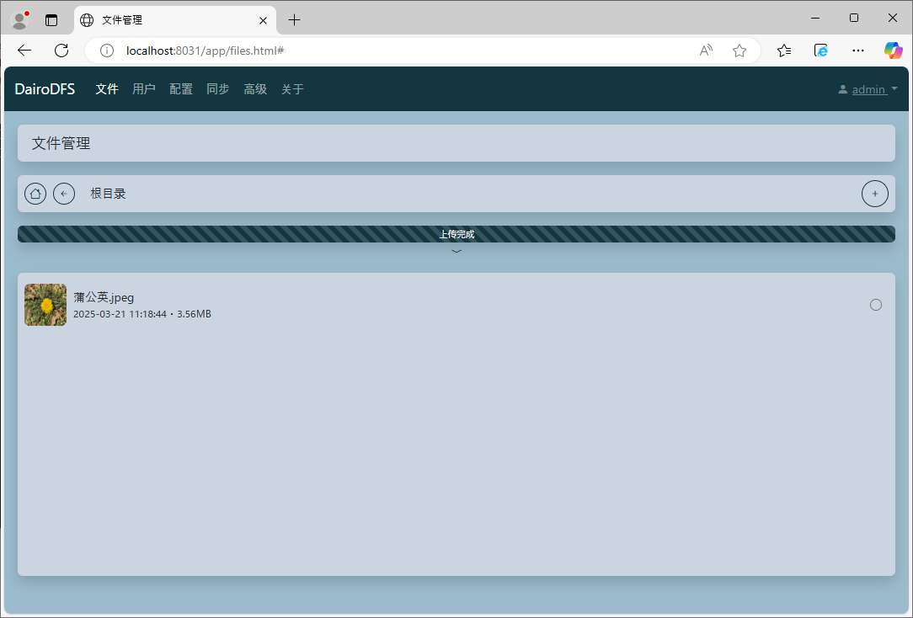

# DairoDFS

# 1. 系统说明

DairoDFS是一个文件存储系统


## 产品特色

### 1). 分布式

支持多端存储、备份，即使其中一台DairoDFS服务器故障，其他DairoDFS服务端也能正常使用，且数据不会丢失。

### 2). 实时性

分布式部署时，集群中的任意一台数据发生变化，会立即同步到其他集群的服务器。

### 3). 高并发

DairoDFS使用go语言开发，支持go语言的高并发特性，即使有大量客户端同时使用，对服务器性能消耗极低。

### 4). 轻量级

DairoDFS使用go语言开发，具有按转包小、占用内存低、CPU消耗低，不影响服务器上其他软件的运行。

# 2. 安装
请根据您的操作系统，从[发行版本](https://github.com/DAIRO-HY/DairoDFS/releases)页面，选择合适的版本进行安装（推介安装最新版本）。

## 1). Windows系统

a. 下载后缀为.exe的文件,并保存到您觉得合适的文件夹（不一定是数据存储的文件夹）。<br>
b. 双击刚刚下载的.exe文件即可运行。

## 2). Mac系统

a. 打开Terminal软件<br>
b. 执行以下bash指令

```bash
#创建文件夹
mkdir ~/dairo-dfs

#进入刚刚创建的文件夹
cd ~/dairo-dfs

#下载安装包
curl -L -o dairo-dfs https://dsdsfsdf.sdfsdf.sdf/sdfs/dsf/sd/fsd/f

#赋予可执行权限
chmod +x dairo-dfs

#启动程序
./dairo-dfs
```

※由于Mac系统安全策略的原因，系统可能会阻止程序运行，请在系统设置里允许程序运行

## 2). Linux系统
执行以下bash指令
```bash
#创建文件夹
mkdir ~/dairo-dfs

#进入刚刚创建的文件夹
cd ~/dairo-dfs

#下载安装包
curl -L -o dairo-dfs https://dsdsfsdf.sdfsdf.sdf/sdfs/dsf/sd/fsd/f

#赋予可执行权限
chmod +x dairo-dfs

#启动程序
./dairo-dfs
```

## 3). Docker安装(Linux推介)

```bash
docker run -p 8031:8031 -v ./data:/app/data dairopapa/dairo-dfs:2.0.0
```

※如果你想通过docker安装，推介使用[docker-compose](./document/docker/docker-compose.yml)部署，

# 3. 配置
## 1). 安装完成之后，请从浏览器打开[http://127.0.0.1:8031](http://127.0.0.1:8031)。<br>
※其中127.0.0.1是你的服务器ip地址，请根据实际情况输入，:8031是程序默认端口，如需更改端口，请参考启动参数。

## 2). 浏览器打开之后请根据页面提示进行设置。

# 4. 启动参数
程序启动时，如需更改默认配置，可以通过以下方式进行修改。<br>
例：
```bash
#更改默认端口为80
./dairo-dfs --port 80
```
### ***--port*** 程序监听端口


# 联系我们
若您在使用过程中遇到任何问题,请扫描下方的微信二维码联系我们。


